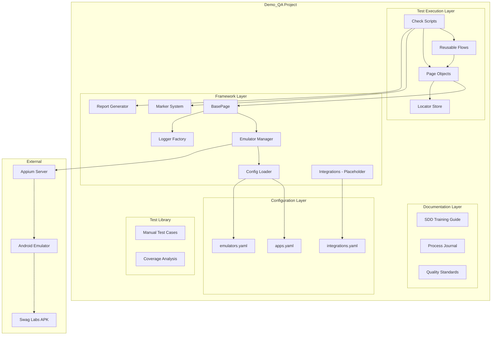
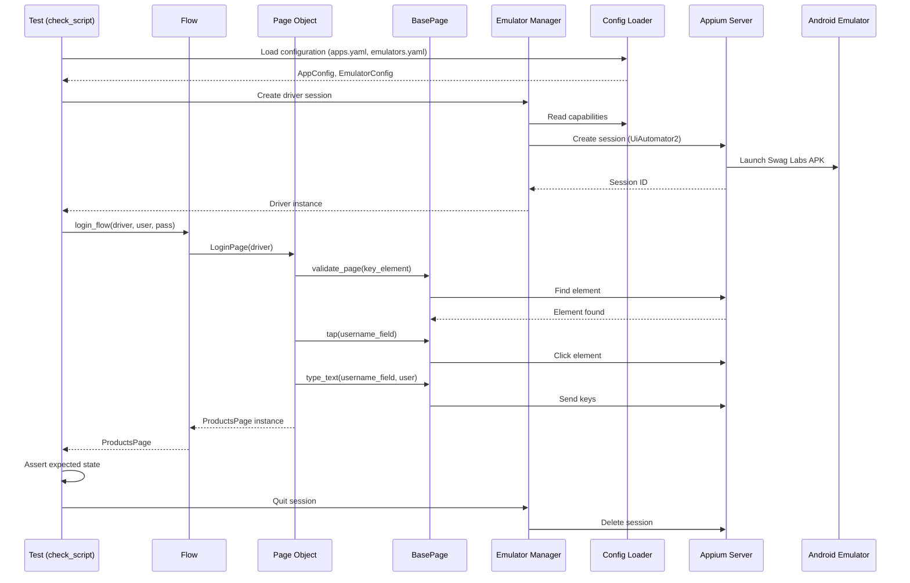
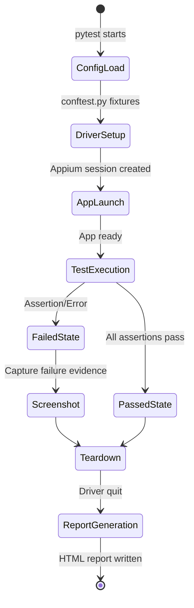
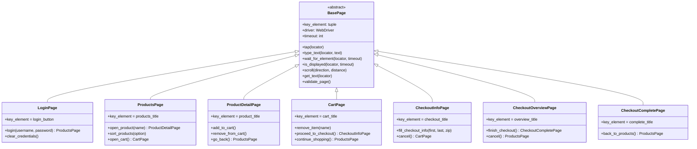

# Design Document: QA Demo/Training (Demo_QA)

## Overview

Demo_QA is a comprehensive QA training showroom that demonstrates the Spec-Driven Development (SDD) process applied to mobile test automation. It packages a mini automation framework (Python + Appium + pytest), a manual test case library, process documentation, and an SDD training guide — all targeting the Swag Labs Mobile app on Android emulators.

The project is structured as a self-contained learning environment where new QA team members can follow the complete lifecycle from app analysis through automated test execution, using the Leroy architecture as a reference pattern simplified for single-project, emulator-only operation.

### Key Design Decisions

| Decision | Choice | Rationale |
|----------|--------|-----------|
| Target app | Swag Labs Mobile (Sauce Labs) | Public, stable, well-documented e-commerce flows |
| Platform | Android emulator only | Removes hardware dependency, simplifies setup |
| Language | Python 3.8+ | Team standard, readable for training |
| Driver | Appium 2.x + UiAutomator2 | Industry standard, matches Leroy |
| Test runner | pytest 7.0+ | Marker system, fixtures, plugin ecosystem |
| Pattern | Page Object Model | Proven pattern, matches Leroy architecture |
| Config format | YAML | Human-readable, supports complex structures |
| Reporting | Self-contained HTML | No external dependencies, shareable |
| Integrations | Jira/Zephyr placeholders | Demonstrates pattern without requiring credentials |

## Architecture

### High-Level Architecture



### Data Flow



### Execution Lifecycle



## Components and Interfaces

### 1. Config Loader (`framework/core/config_loader.py`)

Responsible for loading, validating, and providing access to YAML configuration files.

```python
class ConfigurationError(Exception):
    """Raised when configuration is missing, malformed, or invalid."""
    def __init__(self, file_path: str, issue: str):
        self.file_path = file_path
        self.issue = issue
        super().__init__(f"Configuration error in '{file_path}': {issue}")


class ConfigLoader:
    """Loads and validates YAML configuration with environment variable overrides."""

    def __init__(self, config_dir: str = "config"):
        """
        Args:
            config_dir: Path to configuration directory relative to project root.
        """

    def load_app_config(self) -> dict:
        """Load config/apps.yaml. Raises ConfigurationError if missing/invalid."""

    def load_emulator_config(self) -> dict:
        """Load config/emulators.yaml. Raises ConfigurationError if missing/invalid."""

    def load_integrations_config(self) -> dict:
        """Load config/integrations.yaml. Raises ConfigurationError if missing/invalid."""

    def get(self, section: str, key: str, default=None):
        """
        Get a configuration value with environment variable override.
        Environment variable format: DEMO_QA_<SECTION>_<KEY>
        """

    def _validate_required_keys(self, data: dict, required_keys: list, file_path: str):
        """Validate that all required keys are present and non-empty."""

    def _load_yaml(self, file_path: str) -> dict:
        """Load and parse a YAML file. Raises ConfigurationError on failure."""
```

### 2. Emulator Manager (`framework/core/emulator_manager.py`)

Creates and manages Appium driver sessions for Android emulators.

```python
class EmulatorManager:
    """Manages Appium driver sessions for Android emulators."""

    def __init__(self, config_loader: ConfigLoader):
        """
        Args:
            config_loader: ConfigLoader instance for reading device configuration.
        """

    def create_session(self) -> webdriver.Remote:
        """
        Create an Appium driver session configured for Android/UiAutomator2.
        
        Returns:
            Appium WebDriver instance.
        
        Raises:
            ConnectionError: If Appium server is not reachable within 15 seconds.
            ConfigurationError: If emulator config is missing or invalid.
        """

    def quit_session(self):
        """Quit the current Appium session and clean up resources."""

    def _build_capabilities(self) -> dict:
        """Build UiAutomator2 desired capabilities from configuration."""

    def _check_appium_connection(self, url: str, timeout: int = 15):
        """Verify Appium server is reachable. Raises ConnectionError on failure."""
```

### 3. BasePage (`framework/pages/base_page.py`)

Abstract base class providing common page interaction methods.

```python
class PageNotLoadedError(Exception):
    """Raised when a page fails to load within the expected timeout."""
    def __init__(self, page_name: str, key_element: tuple):
        super().__init__(
            f"Page '{page_name}' failed to load: "
            f"key_element {key_element} not found within timeout"
        )


class BasePage(ABC):
    """Abstract base class for all page objects."""

    key_element: tuple = None  # Must be defined by subclasses

    def __init__(self, driver, timeout: int = 10):
        """
        Args:
            driver: Appium WebDriver instance.
            timeout: Default wait timeout in seconds.
        
        Raises:
            PageNotLoadedError: If key_element not found within timeout.
        """

    def tap(self, locator: tuple):
        """Tap an element identified by locator (strategy, value)."""

    def type_text(self, locator: tuple, text: str):
        """Clear and type text into an element."""

    def wait_for_element(self, locator: tuple, timeout: int = None):
        """Wait for element to be visible. Returns WebElement."""

    def is_displayed(self, locator: tuple, timeout: int = 3) -> bool:
        """Check if element is displayed within timeout."""

    def scroll(self, direction: str = "down", distance: float = 0.5):
        """Scroll the screen in the specified direction."""

    def get_text(self, locator: tuple) -> str:
        """Get text content of an element."""

    def validate_page(self):
        """Validate page loaded by checking key_element presence."""

    def _find_element(self, locator: tuple, timeout: int = None):
        """Internal: find element with explicit wait."""
```

### 4. Marker System (`framework/utils/markers.py`)

Custom pytest markers for test classification and traceability.

```python
def component(name: str):
    """Mark test with a Jira component name for traceability."""

def test_type(type_name: str):
    """
    Classify test type.
    Valid values: 'functional', 'smoke', 'negative', 'boundary', 'integration'
    Raises ValueError for invalid values.
    """

def priority(level: str):
    """
    Mark test priority.
    Valid values: 'critical', 'high', 'medium', 'low'
    Raises ValueError for invalid values.
    """

def domain(domain_name: str):
    """Mark test domain for organizational grouping."""

def get_test_metadata(item) -> dict:
    """Extract all marker metadata from a pytest test item."""
```

### 5. Report Generator (`framework/reporting/html_report.py`)

Generates self-contained HTML test reports.

```python
class ReportGenerator:
    """Generates self-contained HTML test reports after execution."""

    def __init__(self, output_dir: str = "reports"):
        """
        Args:
            output_dir: Directory for report output. Created if not exists.
        """

    def generate(self, results: list, start_time: datetime, end_time: datetime) -> str:
        """
        Generate HTML report from test results.
        
        Args:
            results: List of TestResult objects.
            start_time: Execution start timestamp.
            end_time: Execution end timestamp.
        
        Returns:
            Path to generated report file.
        
        Note:
            Logs error and returns None if file write fails.
        """

    def _build_html(self, results: list, metadata: dict) -> str:
        """Build complete HTML string with inline CSS/JS."""

    def _format_duration(self, seconds: float) -> str:
        """Format duration to 2 decimal places."""
```

### 6. Logger Factory (`framework/utils/logger_factory.py`)

Creates configured loggers with consistent formatting.

```python
def get_logger(name: str, level: str = None) -> logging.Logger:
    """
    Create a named logger with ISO 8601 format.
    
    Format: {ISO_timestamp_ms} {level} {filename}:{lineno} {message}
    Output: Console + logs/session_{timestamp}.log
    
    Args:
        name: Logger name (typically __name__ or class name).
        level: Override log level. Defaults to constants.LOG_LEVEL or INFO.
    """
```

### 7. Reusable Flows (`tests/flows/`)

Composable multi-step operations using page objects.

```python
def login_flow(driver, username: str, password: str) -> ProductsPage:
    """
    Execute login and return ProductsPage.
    
    Raises:
        ValueError: If username or password is empty/None/whitespace.
        PageNotLoadedError: If ProductsPage doesn't load after login.
    """

def add_product_to_cart_flow(driver, product_name: str) -> CartPage:
    """
    Add a product by name and navigate to cart.
    
    Raises:
        ValueError: If product_name is empty/None/whitespace.
        PageNotLoadedError: If expected page transition fails.
    """

def complete_checkout_flow(driver, first_name: str, last_name: str, zip_code: str) -> CheckoutCompletePage:
    """
    Complete checkout with provided info.
    
    Raises:
        ValueError: If any parameter is empty/None/whitespace.
        PageNotLoadedError: If expected page transition fails.
    """
```

### 8. Integration Placeholders (`framework/integrations/`)

```python
# jira_connector.py
class JiraConnector:
    """Placeholder Jira integration. All methods log intended behavior."""

    def test_connection(self) -> bool:
        """Would verify Jira API connectivity. Requires: jira_base_url, api_token."""

    def search_issues(self, jql: str) -> list:
        """Would search issues by JQL. Requires: jira_base_url, api_token."""

    def create_issue(self, project_key: str, summary: str, issue_type: str) -> str:
        """Would create a Jira issue. Requires: jira_base_url, api_token, project_key."""

    def update_issue(self, issue_key: str, fields: dict) -> bool:
        """Would update issue fields. Requires: jira_base_url, api_token."""


# zephyr_reporter.py
class ZephyrReporter:
    """Placeholder Zephyr Scale integration. All methods log intended behavior."""

    def get_test_case(self, test_case_key: str) -> dict:
        """Would retrieve test case by key. Requires: zephyr_api_token."""

    def search_test_cases(self, project_key: str, query: str) -> list:
        """Would search test cases. Requires: zephyr_api_token, project_key."""

    def report_execution(self, test_case_key: str, status: str, cycle_key: str) -> bool:
        """Would report execution result. Requires: zephyr_api_token, cycle_key."""
```

### 9. Coverage Analyzer (`framework/utils/coverage_analyzer.py`)

```python
class CoverageAnalyzer:
    """Maps manual test cases to automated tests and identifies gaps."""

    def __init__(self, test_library_path: str, tests_path: str):
        """
        Args:
            test_library_path: Path to test_library/ directory.
            tests_path: Path to tests/check_scripts/ directory.
        """

    def analyze(self) -> CoverageReport:
        """
        Produce coverage mapping between manual and automated tests.
        
        Returns:
            CoverageReport with mappings, gaps, and statistics.
        """

    def _parse_test_cases(self) -> list:
        """Parse markdown test case files from test_library/."""

    def _discover_check_scripts(self) -> list:
        """Discover automated test functions matching check_T{id}_* pattern."""

    def _match_cases_to_scripts(self, cases: list, scripts: list) -> list:
        """Match test case IDs to corresponding check script functions."""
```

## Data Models

### Configuration Models

```python
@dataclass
class AppConfig:
    apk_path: str           # Path to Swag Labs APK
    package_name: str       # com.swaglabsmobileapp
    activity_name: str      # com.swaglabsmobileapp.MainActivity
    app_version: str        # Version string for reporting

@dataclass
class EmulatorConfig:
    name: str               # Emulator AVD name
    platform_version: str   # Android API level (e.g., "11.0")
    appium_url: str         # Appium server URL (e.g., "http://localhost:4723")
    port: int               # Appium port (1024-65535)

@dataclass
class IntegrationsConfig:
    jira_base_url: str      # Placeholder: "https://your-instance.atlassian.net"
    jira_project_key: str   # Placeholder: "PROJECT"
    jira_api_token: str     # Placeholder: "your-api-token"
    zephyr_cycle_key: str   # Placeholder: "your-cycle-key"
```

### Test Result Models

```python
@dataclass
class TestResult:
    name: str               # Test function name
    status: str             # "passed", "failed", "skipped"
    duration: float         # Execution time in seconds
    traceback: str = None   # Full traceback for failed tests
    screenshot_path: str = None  # Path to failure screenshot
    markers: dict = None    # Marker metadata (component, priority, etc.)

@dataclass
class ReportMetadata:
    execution_date: str     # ISO 8601 format
    total_tests: int
    passed: int
    failed: int
    skipped: int
    duration: float         # Total duration in seconds
```

### Test Case Models (Manual Library)

```python
@dataclass
class ManualTestCase:
    id: str                 # TC_LOGIN_001 format
    title: str              # Max 80 characters
    objective: str          # Starts with "Verify that..." or "Ensure that..."
    preconditions: list     # List of setup conditions
    steps: list             # Numbered steps (min 3)
    expected_results: list  # One per step
    priority: str           # High, Normal, Low
    test_scope: str         # Mandatory Regression, Smoke, Extended Regression
    automation_status: str  # automated, planned, manual-only
    automation_dependency: str  # A, B, C, or D

@dataclass
class CoverageMapping:
    test_case_id: str       # Manual test case ID
    check_script: str       # Corresponding check_T{n}_{desc} or None
    status: str             # automated, planned, manual-only
    justification: str      # Why gap exists (if applicable)
```

### Page Object Hierarchy




## Correctness Properties

*A property is a characteristic or behavior that should hold true across all valid executions of a system — essentially, a formal statement about what the system should do. Properties serve as the bridge between human-readable specifications and machine-verifiable correctness guarantees.*

### Property 1: Configuration Round-Trip

*For any* valid configuration dictionary containing app, emulator, or integration settings, serializing it to YAML and loading it back through ConfigLoader should produce an equivalent dictionary with all values preserved.

**Validates: Requirements 2.6**

### Property 2: Configuration Error Handling

*For any* configuration file path that does not exist, or any file containing invalid YAML syntax, or any valid YAML file missing a required key (or with a null/empty value for a required key), the ConfigLoader SHALL raise a ConfigurationError whose message contains the file path and a description of the specific issue (missing file, malformed YAML, or missing key name).

**Validates: Requirements 2.7, 13.3, 13.6**

### Property 3: Configuration Environment Variable Override

*For any* configuration section and key with a value defined in YAML, and any non-empty override string, setting the environment variable `DEMO_QA_{SECTION}_{KEY}` (uppercase) should cause `ConfigLoader.get(section, key)` to return the environment variable value instead of the YAML file value.

**Validates: Requirements 13.4**

### Property 4: Page Load Validation Error

*For any* page object class name and any locator tuple (strategy, value), when the underlying driver cannot find the key_element within the configured timeout, BasePage instantiation SHALL raise a PageNotLoadedError whose message contains both the page class name and the key_element locator.

**Validates: Requirements 2.3**

### Property 5: Lazy-Loading Deferred Element Location

*For any* page object with locator properties, accessing a locator property for the first time SHALL trigger exactly one element lookup call, and subsequent accesses of the same property SHALL not trigger additional lookups (cached result returned).

**Validates: Requirements 2.4**

### Property 6: Test Naming Convention Validation

*For any* string, the naming validator SHALL accept it if and only if it matches the pattern `check_T{n}_{desc}` where `n` is a positive integer and `desc` contains only lowercase letters, digits, and underscores with a maximum length of 60 characters.

**Validates: Requirements 3.2**

### Property 7: Marker Validation Rejects Invalid Values

*For any* string that is not in the set of valid values for a marker type (test_type valid: {"functional", "smoke", "negative", "boundary", "integration"}; priority valid: {"critical", "high", "medium", "low"}), applying that marker SHALL raise a ValueError indicating the invalid value and the list of allowed values.

**Validates: Requirements 3.6, 3.7**

### Property 8: Marker Metadata Extraction

*For any* combination of valid markers (component, test_type, priority, domain) applied to a pytest test item, `get_test_metadata(item)` SHALL return a dictionary containing all applied marker values with correct keys and no data loss.

**Validates: Requirements 3.4**

### Property 9: Report Generation Correctness

*For any* list of TestResult objects (including empty lists), the ReportGenerator SHALL produce a valid self-contained HTML string that: (a) contains no external CSS/JS references, (b) displays aggregate counts (total, passed, failed, skipped) that exactly match the input data, and (c) for each TestResult in the input, contains the test name, status, and duration — and for failed tests, includes the traceback.

**Validates: Requirements 5.1, 5.2, 5.3, 5.7**

### Property 10: Flow Parameter Validation

*For any* reusable flow function (login_flow, add_product_to_cart_flow, complete_checkout_flow) and any of its required string parameters, passing None, an empty string, or a string composed entirely of whitespace SHALL raise a ValueError whose message identifies which parameter failed validation.

**Validates: Requirements 14.3**

### Property 11: Test Case Structure Validation

*For any* markdown file in the test_library/ directory, parsing it SHALL yield all mandatory fields (ID matching TC_[feature]_[number], title ≤80 chars, objective starting with "Verify that..." or "Ensure that...", preconditions as list, steps numbered with ≥3 entries, expected results one per step, priority in {High, Normal, Low}, test scope, automation status, automation dependency in {A, B, C, D}).

**Validates: Requirements 9.2, 9.4**

### Property 12: Coverage Mapping Correctness

*For any* set of manual test case IDs and set of check script function names following the `check_T{id}_{desc}` pattern, the CoverageAnalyzer SHALL correctly match each test case ID to its corresponding check script (by extracting the numeric ID), report unmatched test cases as gaps, and never produce duplicate or phantom mappings.

**Validates: Requirements 16.1**

## Error Handling

### Error Hierarchy

```
Exception
├── ConfigurationError          # Config loading/validation failures
│   ├── Missing file
│   ├── Invalid YAML syntax
│   └── Missing/empty required key
├── PageNotLoadedError          # Page validation timeout
│   └── Contains page name + locator
├── ConnectionError             # Appium server unreachable
│   └── Contains URL + suggestion
└── ValueError                  # Invalid parameters
    ├── Invalid marker values
    └── Empty/None flow parameters
```

### Error Handling Strategy

| Component | Error Condition | Behavior |
|-----------|----------------|----------|
| ConfigLoader | File missing | Raise ConfigurationError with path |
| ConfigLoader | Invalid YAML | Raise ConfigurationError with path + "malformed" |
| ConfigLoader | Missing key | Raise ConfigurationError with key name + path |
| EmulatorManager | Appium unreachable | Raise ConnectionError with URL + timeout |
| BasePage | key_element timeout | Raise PageNotLoadedError with page name + locator |
| Marker System | Invalid test_type | Raise ValueError with value + valid list |
| Marker System | Invalid priority | Raise ValueError with value + valid list |
| Flow functions | None/empty param | Raise ValueError with parameter name |
| ReportGenerator | File write failure | Log error, return None (no exception) |
| Logger Factory | Invalid log level | Default to INFO, log warning |

### Screenshot on Failure

When a test fails (assertion error or unexpected exception), the conftest.py teardown hook:
1. Captures a screenshot via `driver.save_screenshot()`
2. Saves to `reports/{test_name}_{timestamp}.png`
3. Attaches the path to the test report
4. Proceeds with normal driver teardown

This is implemented as a pytest fixture finalizer, ensuring it runs even on unexpected failures.

## Testing Strategy

### Testing Approach

This project uses a **dual testing approach**:

1. **Property-based tests** — Verify universal correctness properties across generated inputs (100+ iterations per property)
2. **Unit tests** — Verify specific examples, edge cases, and integration points
3. **Integration tests** — Verify end-to-end flows against the actual Appium/emulator stack
4. **Smoke tests** — Verify structural requirements (files exist, directories present)

### Property-Based Testing Configuration

- **Library**: [Hypothesis](https://hypothesis.readthedocs.io/) (Python PBT library)
- **Minimum iterations**: 100 per property
- **Tag format**: `# Feature: qa-demo-training, Property {number}: {property_text}`

### Test Organization

```
tests/
├── unit/
│   ├── test_config_loader.py       # Properties 1, 2, 3
│   ├── test_base_page.py           # Properties 4, 5
│   ├── test_markers.py             # Properties 7, 8
│   ├── test_naming_validator.py    # Property 6
│   ├── test_report_generator.py    # Property 9
│   ├── test_flows_validation.py    # Property 10
│   ├── test_case_parser.py         # Property 11
│   └── test_coverage_analyzer.py   # Property 12
├── integration/
│   ├── test_appium_session.py      # Emulator session creation/teardown
│   ├── test_login_flow.py          # End-to-end login
│   └── test_checkout_flow.py       # End-to-end checkout
└── smoke/
    ├── test_project_structure.py   # Directory/file existence
    ├── test_documentation.py       # Doc files contain required sections
    └── test_configuration.py       # Config files have required keys
```

### Property Test Implementation Plan

| Property | Test File | Key Generators |
|----------|-----------|----------------|
| 1 (Config round-trip) | test_config_loader.py | `st.dictionaries()` with valid config keys |
| 2 (Config errors) | test_config_loader.py | `st.text()` for invalid YAML, `st.sampled_from()` for missing keys |
| 3 (Env override) | test_config_loader.py | `st.text(min_size=1)` for section/key/value |
| 4 (Page load error) | test_base_page.py | `st.text()` for page names, `st.tuples()` for locators |
| 5 (Lazy loading) | test_base_page.py | `st.text()` for locator keys |
| 6 (Naming validation) | test_naming_validator.py | `st.text()` for arbitrary strings, `st.from_regex()` for valid names |
| 7 (Marker validation) | test_markers.py | `st.text().filter(lambda x: x not in valid_set)` |
| 8 (Metadata extraction) | test_markers.py | `st.fixed_dictionaries()` with marker combinations |
| 9 (Report generation) | test_report_generator.py | `st.lists(st.builds(TestResult))` |
| 10 (Flow validation) | test_flows_validation.py | `st.one_of(st.none(), st.just(""), st.text(alphabet=whitespace))` |
| 11 (Test case structure) | test_case_parser.py | `st.builds(ManualTestCase)` with valid/invalid fields |
| 12 (Coverage mapping) | test_coverage_analyzer.py | `st.lists(st.integers(min_value=1))` for IDs |

### Unit Test Coverage Targets

- Config loading: valid configs, edge cases (empty values, special characters in keys)
- BasePage: method signatures, timeout behavior, element interaction delegation
- Markers: valid values accepted, metadata correctly attached
- Report: HTML structure, filename format, empty results handling
- Flows: successful execution paths (with mocked page objects)
- Logger: format verification, dual output, level configuration

### Integration Test Prerequisites

Integration tests require:
- Android emulator running (API 29+)
- Appium server running on configured port
- Swag Labs APK installed on emulator

These tests are marked with `@pytest.mark.integration` and excluded from CI by default.
